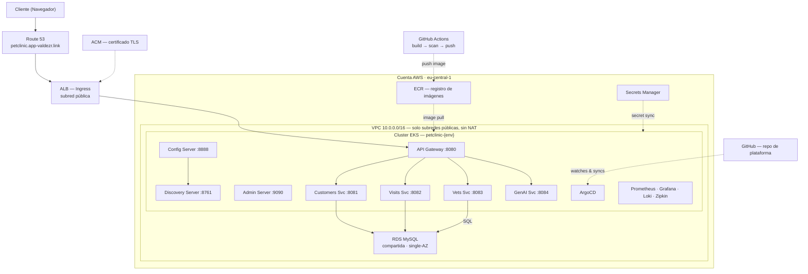

# Agentic Petclinic EKS Platform

*[Read in English →](README.md)*

Infraestructura AWS de nivel productivo para [Spring Petclinic Microservices](https://github.com/spring-petclinic/spring-petclinic-microservices) (8 servicios, Spring Boot, Spring Cloud).

## Resumen

Una plataforma AWS de extremo a extremo que cubre infraestructura (Terraform), orquestación de contenedores (EKS), empaquetado (Helm), entrega GitOps (ArgoCD), integración continua (GitHub Actions) y observabilidad completa (Prometheus/Grafana/Loki/Zipkin) — construida en entornos separados de dev y prod. El alcance completo del trabajo está documentado en un [backlog de Jira con 108 historias](docs/jira-backlog.md) que abarca 16 épicas, desde el estado remoto y networking hasta el endurecimiento de seguridad, autoescalado y GitOps.

## Demo

[Ver el video demo](https://drive.google.com/file/d/1m3G9_ycYHn7oM0ORuLR-suKe94912HiD/view?usp=drive_link) — la aplicación en vivo, el ciclo de despliegue GitOps (GitHub Actions → ECR → ArgoCD), y el stack de observabilidad.

## Construido con Claude Code

Todo el código de infraestructura de este repositorio fue escrito con Claude Code. Cada módulo de Terraform, manifiesto de Kubernetes, chart de Helm y pipeline de CI/CD fue revisado, validado (`terraform plan`, `helm template`, `kubectl apply --dry-run`) y corregido antes de aplicarse — un flujo de trabajo agéntico asistido por IA, no código generado por IA sin revisión.

## Arquitectura

Las flechas continuas son llamadas en tiempo real (ruta de solicitud, SQL). Las flechas punteadas son relaciones de build, deploy o watch (push de CI, sync de ArgoCD, sync de secretos). Dev y prod comparten esta misma forma — prod solo difiere en el número de réplicas, HPA y sync manual de ArgoCD.



## Estructura del Repositorio

```
petclinic-platform/
│
├── terraform/                    # Infraestructura como Código
│   ├── environments/
│   │   ├── dev/                  # Módulo raíz del entorno dev
│   │   │   ├── main.tf
│   │   │   ├── variables.tf
│   │   │   ├── outputs.tf
│   │   │   ├── backend.tf        # Estado en S3: petclinic/dev/terraform.tfstate
│   │   │   └── terraform.tfvars
│   │   └── prod/                 # Módulo raíz del entorno prod
│   │       ├── main.tf
│   │       ├── variables.tf
│   │       ├── outputs.tf
│   │       ├── backend.tf        # Estado en S3: petclinic/prod/terraform.tfstate
│   │       └── terraform.tfvars
│   └── modules/                  # Módulos reutilizables
│       ├── vpc/                  # VPC, subredes, IGW, security groups (todo público, sin NAT), flow logs
│       ├── eks/                  # Cluster EKS, node groups, OIDC/IRSA, secretos cifrados con KMS
│       ├── ecr/                  # Repos ECR (uno por servicio por entorno), políticas de lifecycle, cifrado KMS
│       ├── rds/                  # RDS MySQL, credenciales cifradas con KMS, monitoreo mejorado, TLS forzado
│       ├── dns/                  # Route 53, certificados ACM
│       ├── secrets/              # Recursos de Secrets Manager
│       └── observability/        # Prometheus, Grafana, CloudWatch, FluentBit
│
├── k8s/                          # Manifiestos de Kubernetes
│   ├── base/                     # Manifiestos base (compartidos entre entornos)
│   │   ├── namespaces.yaml
│   │   ├── config-server/        # Deployment, Service, ConfigMap
│   │   ├── discovery-server/
│   │   ├── api-gateway/
│   │   ├── customers-service/
│   │   ├── visits-service/
│   │   ├── vets-service/
│   │   ├── genai-service/
│   │   ├── admin-server/
│   │   ├── ingress/              # Configuración del ALB Ingress Controller
│   │   └── external-secrets/     # Recursos ExternalSecret (AWS Secrets Manager)
│   └── overlays/                 # Parches específicos por entorno
│       ├── dev/                  # Dev: menos réplicas, recursos más pequeños
│       └── prod/                 # Prod: más réplicas, recursos más grandes, HPA
│
├── helm/                            # Charts de Helm
│   └── petclinic-service/           # Chart genérico (compartido por los 8 servicios)
│
├── helm-values/                     # YAML por servicio + por entorno (dev.yaml, prod.yaml)
│
├── .github/workflows/            # CI (GitHub Actions — ArgoCD se encarga del CD)
│   ├── build-push.yml            # Construye imágenes, las sube a ECR
│   └── update-image-tags.yml     # Actualiza el tag de imagen → ArgoCD despliega
│
├── scripts/                      # Scripts operativos
│   ├── bootstrap-state.sh        # Crea el bucket S3 + DynamoDB para el estado de TF
│   ├── ecr-login.sh              # Helper de autenticación con ECR
│   └── build-push-images.sh      # Construye (ARM64) + sube las 8 imágenes de servicio a ECR
│
└── docs/                         # Documentación Operativa
    ├── architecture.md           # Arquitectura de infraestructura y diagramas
    ├── runbook.md                # Operaciones día a día (reinicio, escalado, rollback)
    ├── incident-playbook.md      # Fallas reales encontradas y sus soluciones
    ├── onboarding.md             # Guía de configuración para nuevos ingenieros
    └── adr/                      # Registros de Decisiones de Arquitectura (ADR)
        └── 0001-public-subnets.md  # Decisión de diseño: subredes públicas
```

## Stack Tecnológico

| Capa | Herramienta | Detalles |
|-------|------|---------|
| Nube | AWS | eu-central-1 |
| IaC | Terraform >= 1.6 | Proveedor AWS ~> 5.0, estado en S3 + DynamoDB |
| Cluster | Amazon EKS | Node groups administrados, OIDC |
| Registro | Amazon ECR | Un repo por servicio por entorno, políticas de lifecycle, scan-on-push |
| Base de datos | Amazon RDS MySQL | Single-AZ en ambos entornos (optimización de costo) |
| DNS | Route 53 + ACM | Terminación TLS en el ALB |
| Secretos | AWS Secrets Manager | External Secrets Operator en K8s |
| Ingress | AWS ALB Ingress Controller | ALB público → servicio API Gateway |
| Observabilidad | Prometheus + Grafana | Métricas Micrometer, dashboards, alertas |
| Logging | FluentBit + CloudWatch | Agregación centralizada de logs |
| Tracing | Zipkin | Trazado distribuido (OpenTelemetry) |
| CI | GitHub Actions | OIDC → AWS, build → push a ECR → commit del tag de imagen |
| CD | ArgoCD | GitOps — observa Git, auto-sync (dev), sync manual (prod) |
| Empaquetado | Helm | Chart genérico, valores por servicio + por entorno |
| Escalado de nodos | Karpenter | NodePools, EC2NodeClass, diversificación Spot |

## Entornos

| Entorno | Namespace | CIDR de VPC | RDS | Réplicas / Escalado | Política de Sync |
|-------------|-----------|----------|-----|---------------------|-------------|
| **dev** | `petclinic-dev` | `10.0.0.0/16` | db.t4g.micro, single-AZ (capa gratuita) | 1 por servicio, sin HPA | Auto-sync + self-heal |
| **prod** | `petclinic-prod` | `10.1.0.0/16` | db.t4g.micro, single-AZ (capa gratuita) | 2 por servicio + HPA (la mayoría) | Aprobación manual |

## Créditos

Construido como proyecto final de un curso de DevOps/Cloud Engineering impartido por **Pravin Mishra**, cuya enseñanza hizo posible este proyecto.
