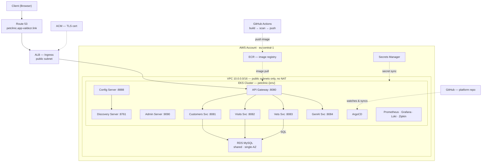

# Agentic Petclinic EKS Platform

Production AWS infrastructure for [Spring Petclinic Microservices](https://github.com/spring-petclinic/spring-petclinic-microservices) (8 services, Spring Boot, Spring Cloud).

## Overview

An end-to-end AWS platform covering infrastructure (Terraform), container orchestration (EKS), packaging (Helm), GitOps delivery (ArgoCD), CI (GitHub Actions), and full observability (Prometheus/Grafana/Loki/Zipkin) — built across separate dev and prod environments. The full scope of work is tracked in a [108-story Jira backlog](docs/jira-backlog.md) spanning 16 epics, from remote state and networking through security hardening, autoscaling, and GitOps.

## Built With Claude Code

All infrastructure code in this repo was written with Claude Code. Every Terraform module, Kubernetes manifest, Helm chart, and CI/CD pipeline was reviewed, validated (`terraform plan`, `helm template`, `kubectl apply --dry-run`), and corrected before applying — an AI-assisted, agentic workflow, not AI-generated-and-unchecked code.

## Architecture

Solid arrows are live runtime calls (request path, SQL). Dashed arrows are build, deploy, or watch relationships (CI push, ArgoCD sync, secret sync). Dev and prod share this shape — prod differs only in replica counts, HPA, and manual ArgoCD sync.



## Repository Structure

```
petclinic-platform/
│
├── terraform/                    # Infrastructure as Code
│   ├── environments/
│   │   ├── dev/                  # Dev environment root module
│   │   │   ├── main.tf
│   │   │   ├── variables.tf
│   │   │   ├── outputs.tf
│   │   │   ├── backend.tf        # S3 state: petclinic/dev/terraform.tfstate
│   │   │   └── terraform.tfvars
│   │   └── prod/                 # Prod environment root module
│   │       ├── main.tf
│   │       ├── variables.tf
│   │       ├── outputs.tf
│   │       ├── backend.tf        # S3 state: petclinic/prod/terraform.tfstate
│   │       └── terraform.tfvars
│   └── modules/                  # Reusable modules
│       ├── vpc/                  # VPC, subnets, IGW, security groups (all-public, no NAT), flow logs
│       ├── eks/                  # EKS cluster, node groups, OIDC/IRSA, KMS-encrypted secrets
│       ├── ecr/                  # ECR repos (per service per env), lifecycle policies, KMS encryption
│       ├── rds/                  # RDS MySQL, KMS-encrypted credentials, enhanced monitoring, TLS enforced
│       ├── dns/                  # Route 53, ACM certificates
│       ├── secrets/              # Secrets Manager resources
│       └── observability/        # Prometheus, Grafana, CloudWatch, FluentBit
│
├── k8s/                          # Kubernetes Manifests
│   ├── base/                     # Base manifests (shared across envs)
│   │   ├── namespaces.yaml
│   │   ├── config-server/        # Deployment, Service, ConfigMap
│   │   ├── discovery-server/
│   │   ├── api-gateway/
│   │   ├── customers-service/
│   │   ├── visits-service/
│   │   ├── vets-service/
│   │   ├── genai-service/
│   │   ├── admin-server/
│   │   ├── ingress/              # ALB Ingress Controller config
│   │   └── external-secrets/     # ExternalSecret resources (AWS Secrets Manager)
│   └── overlays/                 # Environment-specific patches
│       ├── dev/                  # Dev: fewer replicas, smaller resources
│       └── prod/                 # Prod: more replicas, larger resources, HPA
│
├── helm/                            # Helm Charts
│   └── petclinic-service/           # Generic chart (shared by all 8 services)
│
├── helm-values/                     # Per-service YAML + per-env (dev.yaml, prod.yaml)
│
├── .github/workflows/            # CI (GitHub Actions — ArgoCD handles CD)
│   ├── build-push.yml            # Build images, push to ECR
│   └── update-image-tags.yml     # Commit image tag updates → ArgoCD deploys
│
├── scripts/                      # Operational scripts
│   ├── bootstrap-state.sh        # Create S3 bucket + DynamoDB for TF state
│   ├── ecr-login.sh              # ECR authentication helper
│   └── build-push-images.sh      # Build (ARM64) + push all 8 service images to ECR
│
└── docs/                         # Operational Documentation
    ├── architecture.md           # Infrastructure architecture & diagrams
    ├── runbook.md                # Day-2 operations (restart, scale, rollback)
    ├── incident-playbook.md      # Common failures & fixes
    ├── onboarding.md             # New engineer setup guide
    └── adr/                      # Architecture Decision Records
        └── 0001-public-subnets.md  # All-public subnet design decision
```

## Tech Stack

| Layer | Tool | Details |
|-------|------|---------|
| Cloud | AWS | eu-central-1 |
| IaC | Terraform >= 1.6 | AWS provider ~> 5.0, S3 + DynamoDB state |
| Cluster | Amazon EKS | Managed node groups, OIDC |
| Registry | Amazon ECR | One repo per service per env, lifecycle policies, scan-on-push |
| Database | Amazon RDS MySQL | Single-AZ both envs (cost optimization) |
| DNS | Route 53 + ACM | TLS termination at ALB |
| Secrets | AWS Secrets Manager | External Secrets Operator in K8s |
| Ingress | AWS ALB Ingress Controller | Public ALB → API Gateway service |
| Observability | Prometheus + Grafana | Micrometer metrics, dashboards, alerts |
| Logging | FluentBit + CloudWatch | Centralized log aggregation |
| Tracing | Zipkin | Distributed tracing (OpenTelemetry) |
| CI | GitHub Actions | OIDC → AWS, build → push ECR → commit image tag |
| CD | ArgoCD | GitOps — watches Git, auto-sync (dev), manual sync (prod) |
| Packaging | Helm | Generic chart, per-service + per-env values |
| Node Scaling | Karpenter | NodePools, EC2NodeClass, Spot diversification |

## Environments

| Environment | Namespace | VPC CIDR | RDS | Replicas / Scaling | Sync Policy |
|-------------|-----------|----------|-----|---------------------|-------------|
| **dev** | `petclinic-dev` | `10.0.0.0/16` | db.t4g.micro, single-AZ (free tier) | 1 per service, no HPA | Auto-sync + self-heal |
| **prod** | `petclinic-prod` | `10.1.0.0/16` | db.t4g.micro, single-AZ (free tier) | 2 per service + HPA (most) | Manual approval |
